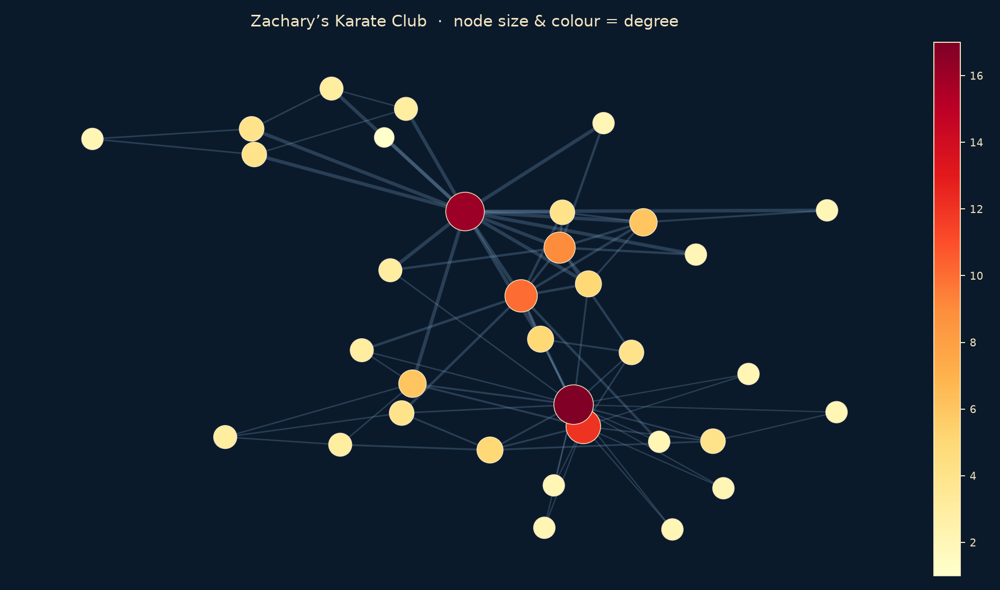

# It’s not you, it’s the math

### Your friends are *(probably)* more important than you

<p align="center">
  
</p>

<p align="center">
  <a href="paper/MIORPA.pdf"></a>
  
  
  
</p>

A short empirical and theoretical study of the **Generalized Friendship Paradox** (GFP): on average, your neighbours look more central than you do — in degree, and in five other importance scores.

Developed for the [Mathematical Institute’s Online Research Projects with Africa](https://www.maths.ox.ac.uk/outreach/miorpa) (MIORPA) 2026 programme at the University of Oxford.

**Authors.** [Samuel Kangoni Matia](https://scholar.google.com/citations?user=55P3_qMAAAAJ&hl=en&oi=ao) (University of Kinshasa) · [Francesco Hrobat](https://fhrobat.github.io/) (University of Oxford)

---

## The idea in one line

Pick a person at random. Then pick one of their friends. That friend is typically *more connected* than the person you started with. The same bias appears for eigenvector, walk, Katz, exponential, and non-backtracking centrality.

$$
\Delta_{\mathrm{GFP}} = \mathbb{E}[x_{\mathrm{neigh}}] - \mathbb{E}[x] \ge 0 \qquad\text{where}\qquad \mathbb{E}[x_{\mathrm{neigh}}] = \frac{d^\top x}{\mathbf{1}^\top d}
$$

Locally, node $i$ sees a gap between itself and its immediate neighbourhood:

$$
\Delta_i = (D^{-1} A x)_i - x_i
$$

We also propose a new centrality, **local standing** score, $\exp(-\Delta_i)$: hubs that outrank their neighbours score above 1; nodes that sit below their friends score in $(0,1)$.

Real networks amplify the effect far more than density-matched **Erdős–Rényi** graphs. Inequality, not chance, is doing most of the work.

---

## What’s inside

| Path | Role |
| --- | --- |
| [`report/MIORPA.pdf`](report/MIORPA.pdf) | Full report |
| [`01_centrality_foundations.ipynb`](01_centrality_foundations.ipynb) | Centralities, notation, and the friendship-paradox setup |
| [`02_friendship_paradox_real_random_graphs.ipynb`](02_friendship_paradox_real_random_graphs.ipynb) | Experiments on real graphs vs $G(n,p)$ |
| [`figs/`](figs) | Density plots and other figures from the paper |
| [`outputs/`](outputs) | Spreadsheet summaries of global and local gaps |

**Networks.** Karate Club, Florentine families, Les Misérables, Cora, CiteSeer.

**Centralities.** Degree · Eigenvector · Walk · Katz · Exponential (total subgraph communicability) · Non-backtracking.

---

## Run it

```bash
python -m venv .venv
source .venv/bin/activate
pip install -r requirements.txt
jupyter lab
```

Then open the notebooks in order. The small NetworkX graphs run without extra downloads. **Cora** and **CiteSeer** are loaded with PyTorch Geometric (`Planetoid`) into `./data/` (gitignored).

---

## Cite

```bibtex
@unpublished{matia2026friends,
  title   = {It's not you, it's the math: your friends are (probably) more important than you},
  author  = {Matia, Samuel Kangoni and Hrobat, Francesco},
  year    = {2026},
  note    = {MIORPA, Mathematical Institute, University of Oxford}
}
```

Code is released under the [MIT License](LICENSE). The report in `paper/` remains copyright of the authors.
